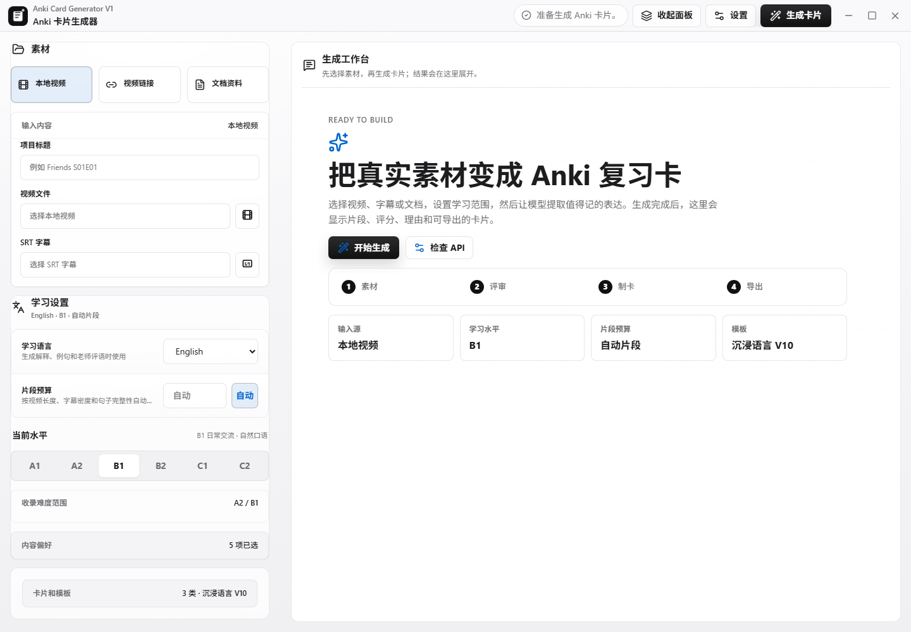
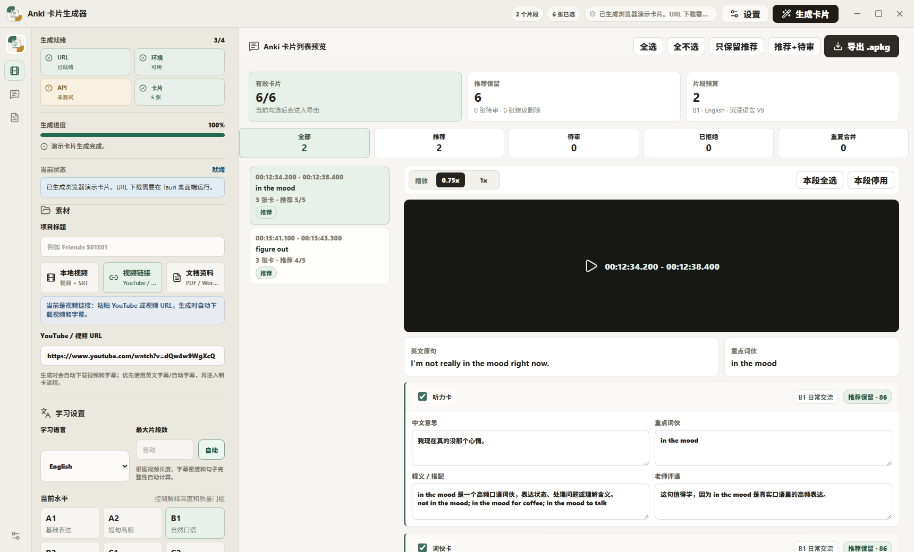
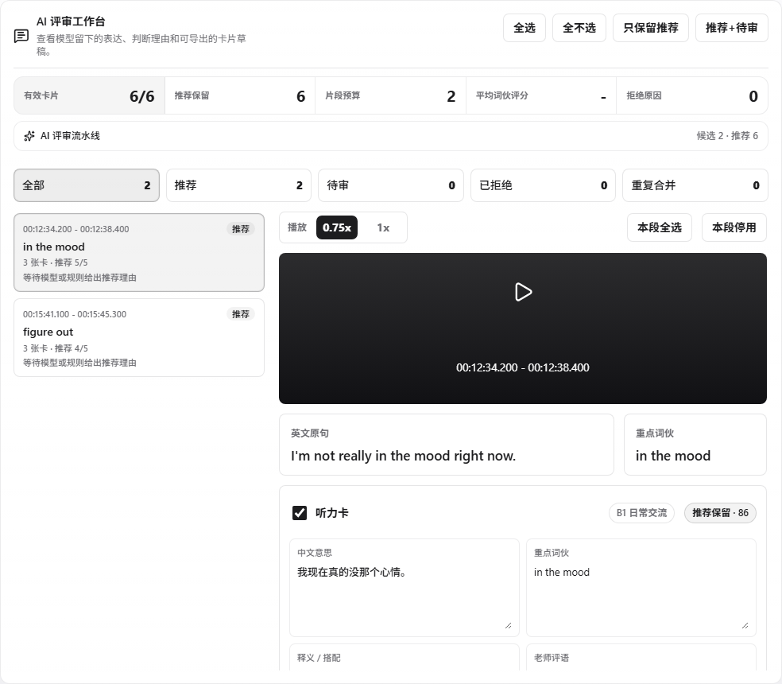
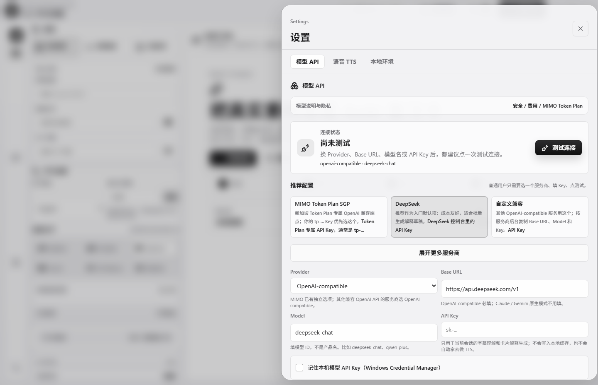

# Anki Card Generator

一个面向中文母语者的英语 Anki 卡片生成器。它可以从 YouTube / 本地视频 / SRT / 文档中提取可迁移词伙，生成带视频片段、原声、TTS、释义、例句和填空的 Anki 卡包。

当前版本：`v0.9.2-beta`

## Beta 风险和数据边界

这是 Windows 内测版本。YouTube 下载、字幕接口、模型 API、TTS 和本机 FFmpeg / Python 环境都会影响成功率。

- YouTube 导入依赖 yt-dlp，可能因为 429、区域限制、字幕接口变化或 n challenge 失败。
- 使用 MIMO、DeepSeek、OpenRouter、Claude、Gemini、xAI 等模型时，字幕、文档片段、卡片字段和 TTS 文本会发送给对应服务商。
- TTS 会产生 API 调用费用；导出前请确认服务商计费规则。
- 视频片段、字幕和文档可能受版权保护；生成的 `.apkg` 默认仅供个人学习使用，不建议公开分发。
- 更完整的限制见 [Beta 限制说明](docs/BETA_LIMITATIONS.md)，数据流说明见 [Privacy](PRIVACY.md)。

## 功能

- 极简两片式桌面界面：左侧 Inspector 管理素材和学习设置，右侧 Workspace 负责生成、审核和导出。
- 窗口最小尺寸保护：桌面端不会缩到破坏布局的尺寸。
- YouTube URL 导入：自动下载视频和英文字幕。
- 本地视频 + SRT：适合自己已有素材。
- 文档制卡：支持 TXT、Markdown、DOCX、EPUB、PDF。
- MIMO 词伙评审：优先保留可迁移表达，低价值内容默认不导出。
- 自动片段预算：根据视频长度和字幕密度自动决定候选数量。
- 自适应 Anki 模板：卡片在不同窗口尺寸下自动缩放。
- 多音频导出：视频原声、整句 TTS、词伙 TTS。
- Anki `.apkg` 导出：可手动导入 Anki，也可调用本机 Anki 打开。

## 工作流程


## 界面预览

主界面采用两片式工作台：左侧收纳素材和学习设置，右侧展示质量筛选、卡片预览和导出结果；复杂选项会收在展开项里：



从 YouTube URL 或本地视频生成后，右侧可以按推荐、待审、已拒绝、重复合并筛选卡片，并在导出前逐张编辑：



卡片详情会显示视频片段、原句、词伙、质量评分、中文理解、搭配和老师评语：



设置页集中管理文本模型、MIMO TTS 和本地环境检查；API Key 只在本机填写，不写入仓库：



## Windows 快速开始

推荐先下载 GitHub Release 里的 Windows 便携包：

1. 解压 `AnkiCardGenerator-v0.9.2-beta-windows-portable.zip`。
2. 右键 `scripts/setup_runtime.ps1`，用 PowerShell 运行；脚本会创建项目本地 `.venv`、安装 worker 依赖，并输出 `runtime_diagnostic.json`。
3. 打开 `Anki Card Generator.exe`。
4. 进入设置，点击“检查环境”，再填写自己的 MIMO API Key 并测试连接。
5. 用内置示例、本地视频 + SRT，或 YouTube URL 生成并导出 `.apkg`。

如果 YouTube 触发 429、n challenge 或字幕接口失败，URL 面板可以切到“只用字幕生成”或“跳过视频切片”，先把卡片做出来。

详细图文流程见 [用户指南](docs/USER_GUIDE.md)。

## 必需依赖

便携包不内置这些外部运行时，首次使用前需要安装：

| 依赖 | 用途 |
| --- | --- |
| Python 3.11+ | 运行制卡 worker |
| genanki | 生成 `.apkg` |
| yt-dlp | 下载 YouTube 视频和字幕 |
| Deno 2.0+ 或 Node.js 20+ | 帮 yt-dlp 解 YouTube EJS / n challenge |
| pypdf | 读取 PDF 文档 |
| FFmpeg | 切视频、转音频、生成封面 |
| Anki | 导入和复习卡片 |

Python 依赖建议安装到项目本地 `.venv`，不要污染全局 Python：

```powershell
powershell -ExecutionPolicy Bypass -File scripts/setup_runtime.ps1
```

## 开发运行

```powershell
npm install
npm run tauri:dev
```

## 构建 Windows 包

```powershell
npm run build
npm run tauri:build
```

构建产物位于：

- `src-tauri/target/release/bundle/nsis/*.exe`
- `src-tauri/target/release/bundle/msi/*.msi`

可以用脚本生成便携包：

```powershell
powershell -ExecutionPolicy Bypass -File scripts/package_portable.ps1 -ReleaseExe "src-tauri/target/release/Anki Card Generator.exe"
```

## 隐私和密钥

- 不要把真实 API Key 写进源码、README、issue 或 release note。
- API Key 只应该由用户在本机设置页填写；默认不会把文本/TTS Key 写入 localStorage。只有用户显式勾选“记住本机 Key”时，才会保存到 Windows Credential Manager。
- 使用第三方模型或 TTS 时，字幕、文档片段和生成字段会发送给对应服务商。
- 生成的视频、音频、`.apkg`、项目缓存默认不会提交到 Git。

## 许可证状态

当前仓库还没有选择正式开源许可证，代码和发行包的授权范围需要在公开推广前确认。生成的牌组如果包含第三方视频、字幕、文档摘录或合成音频，默认只用于个人学习，不应在没有授权的情况下重新分发。

## 发布验证

发布前请跑：

```powershell
npm run check
npm run test:ui
npm run tauri:build
powershell -ExecutionPolicy Bypass -File scripts/smoke_release.ps1
```

发布清单见 [Release Checklist](docs/RELEASE_CHECKLIST.md)。
