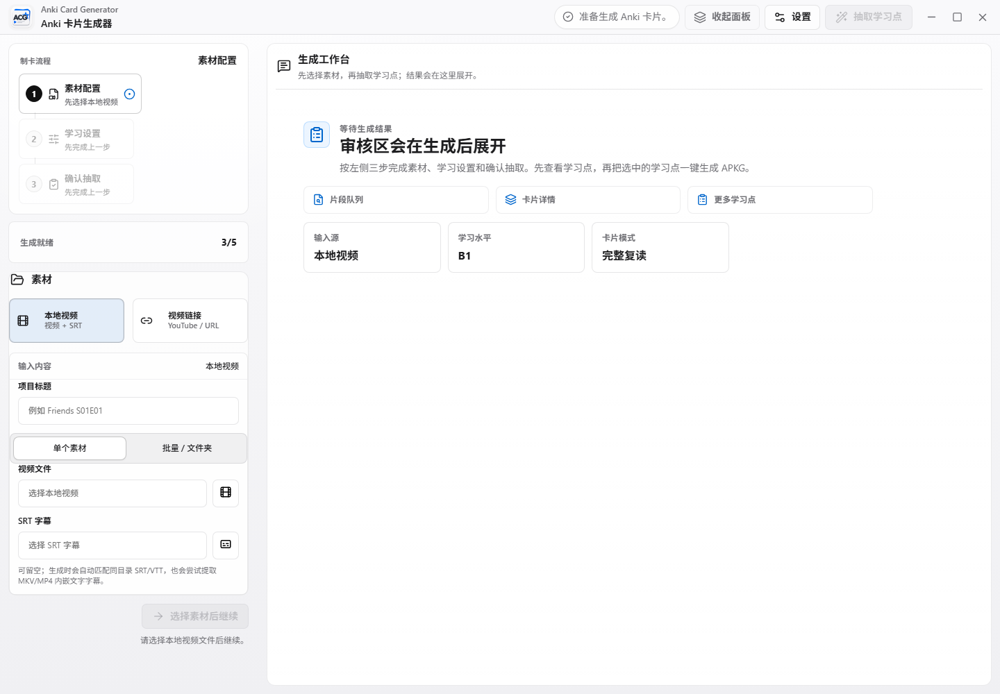
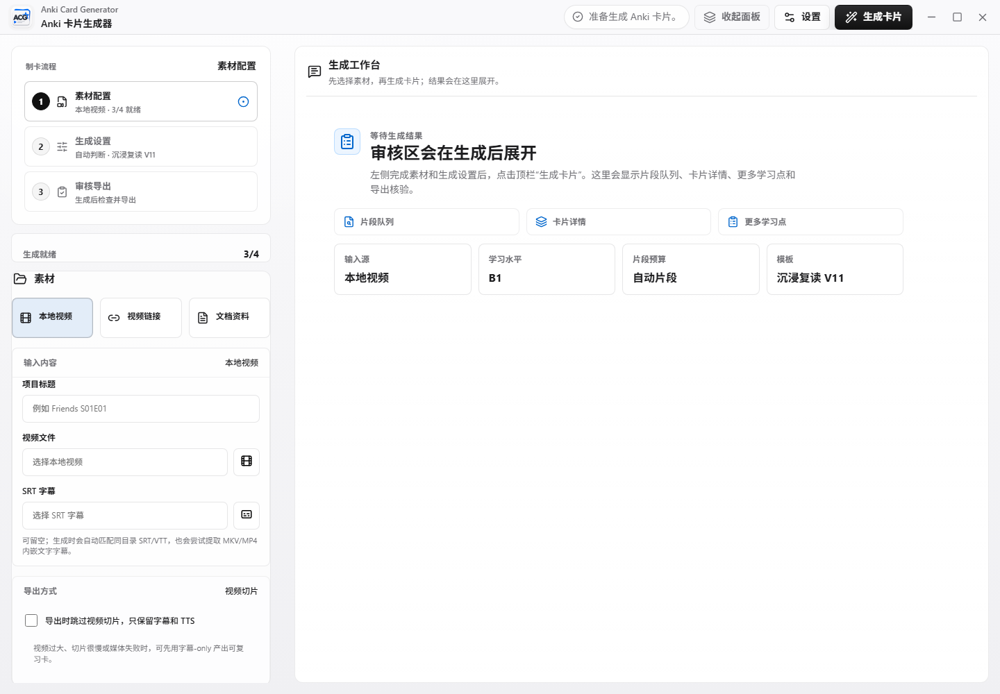
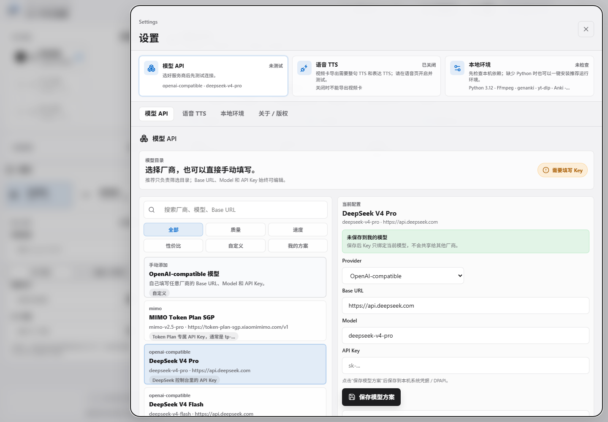
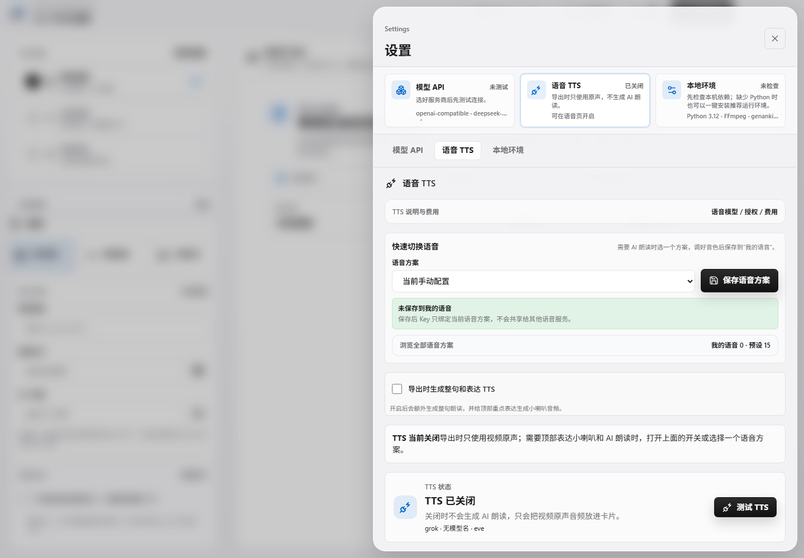
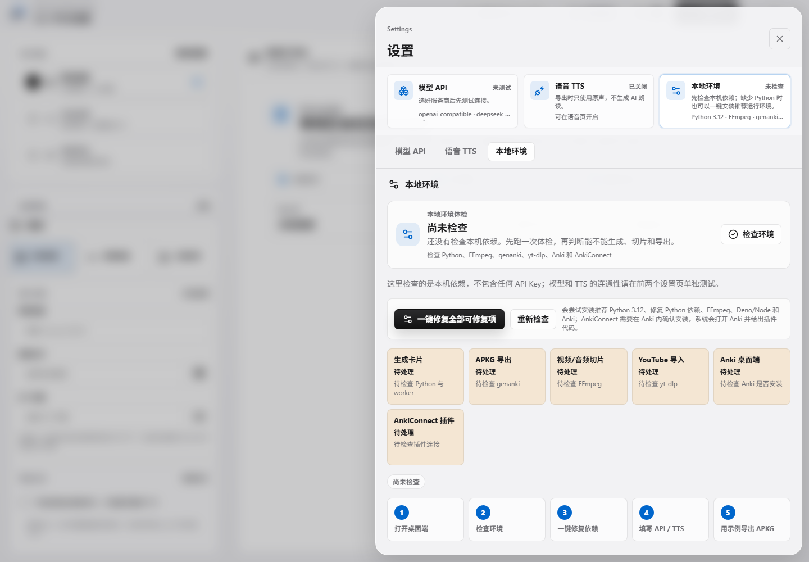
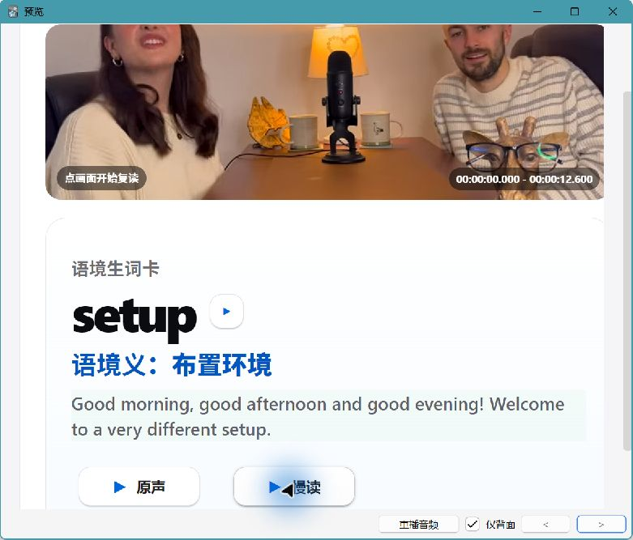
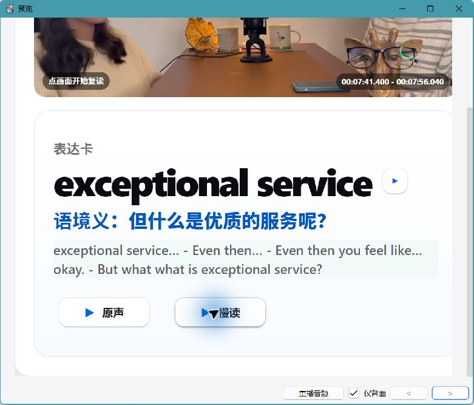

# Anki Card Generator

面向中文学习者的 Windows 桌面端视频制卡工具。它把本地视频 + 字幕或视频链接变成可审核、可导出、可导入 Anki 的 `.apkg` 复读卡包。

当前测试版：`v0.9.5-beta`。

## 选择你的版本

| 用户 | 当前应该使用什么 | 状态 |
| --- | --- | --- |
| Windows 用户 | GitHub Release 里的 Windows installer / MSI / portable zip | 当前可用 |
| Windows 开发者 | 本仓库 Tauri 桌面端开发环境 | 当前可用 |
| macOS / Linux 用户 | 当前暂无可用桌面端安装包 | 暂不支持 |
| 开源贡献者 | 先阅读本仓库 Windows 桌面端文档 | 当前聚焦桌面端 |

当前可下载产品是 **Windows 桌面端**。macOS / Linux 暂无可用安装包；请不要下载 Windows 安装器在这些系统上运行。

## 它适合做什么

- 从 YouTube /公开视频链接生成语言学习卡。
- 从本地 `mp4/webm/mkv/mov` + `srt/vtt` 字幕生成卡。
- 在生成前先抽取并推荐学习点，用户自己决定生成哪些卡。
- 导出 Anki `.apkg`，并通过 AnkiConnect 做导入与媒体核验。
- 为每张视频卡保留视频片段、原声、整句 TTS、表达 TTS、中文语境义和学习提示。

当前公开主流程只保留两条入口：`本地视频 + 字幕` 和 `视频链接`。历史文档制卡、实验模板和内部诊断能力不作为普通用户入口展示。

## v0.9.5-beta 重点

- **无终端弹窗 Windows 桌面包**：`v0.9.5-beta` 是新的 Windows 安装包版本，不覆盖 `v0.9.4-beta`，方便用户用 SHA256 追踪真实下载资产。
- **窗口压缩时左侧控制台仍可操作**：最小宽度会进入“素材面板”模式，批量素材、文件夹选择和底部继续按钮都保持可达。
- **左侧流程滚动更稳定**：流程状态固定，阶段内容独立滚动，主操作区不会被批量素材区域挤出窗口。
- **视频制卡主链路完成 8/8 真实验收矩阵**：YouTube、本地视频 + SRT、完整复读、快速复读、cold/hot cache、100+ 张一次点击压力包均已通过。
- **启动和制卡过程不再弹黑色终端**：安装版普通启动只显示桌面 UI；开发入口 `desktop:dev` 默认隐藏 Tauri/Vite 调试终端，worker 调用 `ebook-convert`、`ffprobe` 等外部工具时也使用 Windows 隐藏子进程窗口。需要排查时可用 `desktop:dev:debug` 显示调试窗口。
- **卡片质量闸更硬**：素材不可读、TTS 最终失败、媒体切片失败、ledger/hash mismatch、APKG verify fail 会阻止导出。
- **用户选择更可信**：用户勾选 N 个可制卡学习点，目标就是生成 N 张卡；模型漏字段时会尽量补齐保底卡并记录诊断。
- **缓存和速度更透明**：记录 cold/hot、cache hit/miss、TTS、媒体切片、APKG 打包和 Anki verify 阶段耗时。
- **公开仓库更干净**：生成媒体、APKG、test runs、缓存、日志、内部 handoff 和本地密钥文件默认不会进入 Git。

## 界面与成品卡

### 桌面端工作台



### 学习点生成与审核导出




### 设置页

模型 API、TTS、本地环境检测分开配置。Vertex 模式使用本机 `gcloud` OAuth；其它 OpenAI-compatible 服务商可以保存到本机凭据。







### Anki 成品卡

下面三张来自 `100+ 张一次点击压力包` 的真实 Anki Preview 抽查，覆盖开头、中间和结尾卡片。






## 卡片模式

普通视频制卡只暴露 `沉浸复读 V11`，并提供两种复读模式：

| 模式 | 适合场景 | 卡面内容 |
| --- | --- | --- |
| 完整复读 | 深度学习、精听、表达复盘 | 视频、原声、整句 TTS、表达 TTS、释义、用法、误用提醒、发音和练习提示 |
| 快速复读 | 批量复习、轻量跟读 | 正面同 V11，背面保留原句、中文意思、视频、原声、慢读 TTS 和表达 TTS |

## 快速开始

1. 安装或解压 Windows release 包；推荐使用 `v0.9.5-beta` 或更新版本。
2. 打开 `Anki Card Generator.exe`。正常情况下只会出现桌面 UI，不应额外弹出黑色终端窗口。
3. 进入 `设置 -> 本地环境`，点击 `检查环境`。
4. 按提示安装或修复 Python、FFmpeg、Anki、AnkiConnect 等依赖。
5. 进入 `模型 API`，选择模型服务商，测试连接并保存。
6. 进入 `语音 TTS`，选择 TTS 服务商和音色，测试连接并保存。
7. 回到主界面，选择 `本地视频 + 字幕` 或 `视频链接`。
8. 点击 `抽取学习点`，等待 AI 精筛推荐/候选学习点。
9. 勾选想生成的学习点，点击 `生成已勾选的 N 张`。
10. 在审核页检查卡片，取消不想导出的卡。
11. 点击 `导出可用的 N 张` 生成 `.apkg`。
12. 使用 `打开 Anki` / `导入并核验` 检查 note、媒体、音频和卡面。

完整图文教程见 [用户指南](docs/USER_GUIDE.md)。

## 依赖与环境

| 项目 | 用途 | 当前处理方式 |
| --- | --- | --- |
| Python 3.12 | 运行 worker、生成 APKG、处理媒体账本 | 原生层检测，缺失时可尝试自动安装 |
| FFmpeg | 视频切片、原声音频、媒体转换 | 设置页检测，缺失时可尝试自动安装 |
| yt-dlp | 视频链接下载 | worker 依赖安装 |
| Anki 桌面端 | 导入和预览卡包 | 设置页检测，缺失时可尝试安装 |
| AnkiConnect | 导入后核验 note/card/media | 需要用户在 Anki 插件页安装插件代码 `2055492159` |

## 模型与 TTS

应用支持按服务商保存模型和 TTS 配置。文本模型与 TTS 分开设置，避免把同一个 API key 和模型配置混用。

常见配置包括：

- Gemini Vertex / Vertex TTS：使用本机 `gcloud` OAuth。
- OpenAI-compatible endpoint：可填自定义 base URL、model、API key。
- Qwen / DashScope。
- DeepSeek。
- 其它兼容服务商。

不要把真实 API key 写进源码、README、issue、日志或截图。选择“记住本地 key”时，应用优先保存到 Windows Credential Manager；不可用时使用本机 DPAPI 加密文件。

## 开发运行

```powershell
npm install
npm.cmd run desktop:dev
```

`desktop:dev` 会隐藏 Tauri 调试终端，只显示桌面 UI；日志仍写入：

```text
.tauri-dev-current.out
.tauri-dev-current.err
.vite-dev-current.out
.vite-dev-current.err
```

需要看到调试终端时运行：

```powershell
npm.cmd run desktop:dev:debug
```

底层 Tauri 命令仍保留：

```powershell
npm.cmd run tauri:dev
```

## 验证

常用检查：

```powershell
npm.cmd run check
cargo check --manifest-path src-tauri/Cargo.toml
```

发布前检查：

```powershell
npm.cmd run check:full
npm.cmd run tauri:build
```

最新 release-hardening 证据状态：

- 8/8 release matrix passed。
- 202 张目标卡完成真实生成/导出/导入核验。
- 112 张 Anki Preview 检查覆盖 1 张、20 张和 100+ 张包。
- 100+ 压力包证明：用户一次点击生成，内部可分批，不影响用户操作模型。
- `npm.cmd run check`、`cargo check --manifest-path src-tauri/Cargo.toml` 已通过。

## 隐私、版权与安全

- 使用第三方模型或 TTS 时，字幕、学习点、卡片字段和 TTS 文本会发送给用户配置的服务商。
- 生成的视频片段、音频、字幕、`.apkg`、项目缓存和 test runs 默认不提交到 Git。
- 第三方视频、字幕和合成音频默认仅供个人学习使用；公开分享 deck 前请确认你有权分发底层素材。
- 不要上传真实 API key、私有视频、私有字幕、私人路径、完整生成缓存或 Anki 用户数据。

## 更多文档

- [用户指南](docs/USER_GUIDE.md)
- [故障排查](docs/TROUBLESHOOTING.md)
- [架构说明](docs/ARCHITECTURE.md)
- [发布清单](docs/RELEASE_CHECKLIST.md)
- [Beta 限制](docs/BETA_LIMITATIONS.md)
- [隐私说明](PRIVACY.md)
- [安全策略](SECURITY.md)
