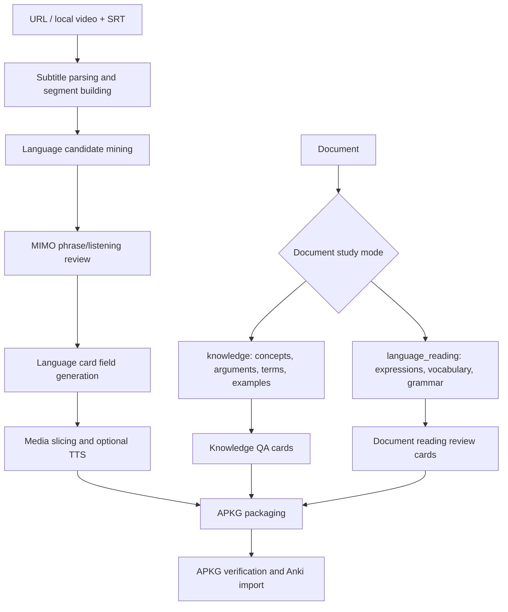

# Architecture

This document describes the `v0.9.2-beta` desktop architecture at the level needed for maintenance and release checks.

## Product Pipelines



## Frontend

The React app uses a two-pane desktop layout:

- Left Inspector: source input, source-specific study settings, card/template preferences, and readiness summaries.
- Right Workspace: empty/ready/running/review/exported states, quality summary, segment list, card editor, and export result.

The top-level entry is intentionally thin:

- `src/App.tsx` mounts the app.
- `src/app/useAppController.ts` owns request/project/job state and user actions.
- `src/app/AppShell.tsx` renders the desktop shell.
- `src/domain/*` stores types, options, defaults, providers, selectors, and worker error mapping.
- `src/services/*` wraps Tauri worker jobs, secret storage, project storage, and media helpers.

Complex settings should stay collapsed in the Inspector, but every collapsed section must keep a useful summary such as source type, API status, TTS mode, or segment budget.

Document mode is intentionally separated from the video language-learning controls:

- `knowledge` is the default path and hides CEFR levels, listening cards, phrase cards, and language content toggles.
- `language_reading` is opt-in and only exposes document reading settings for expressions, vocabulary, and grammar. It does not generate listening cards because documents do not have source audio.
- The frontend persists document study fields on both `GenerateRequest` and `Project`, and old stored requests fall back to knowledge defaults.

## Tauri Boundary

The Rust backend is the trusted local boundary between the WebView and Python worker.

- Worker commands are whitelisted.
- Long-running generate/export work uses job IDs and emits progress/finished events.
- `open_anki_import` only accepts `.apkg` files.
- `reveal_path` is restricted to app/project/release output locations.
- Secret persistence goes through the Tauri backend and Windows Credential Manager when the user explicitly enables remembering a key.

## Worker

`workers/anki_worker.py` is now a small command router. The legacy implementation remains in `workers/acg/legacy_worker.py` while command boundaries are being extracted. New shared protocol helpers live under `workers/acg/`.

Current command modules:

- `workers/acg/commands/check_env.py`
- `workers/acg/commands/generate.py`
- `workers/acg/commands/export.py`
- `workers/acg/commands/test_api.py`
- `workers/acg/commands/test_tts.py`
- `workers/acg/commands/verify.py`

The worker response protocol is backward-compatible and can add:

- `schema_version`
- `warnings`
- `error_code`
- `stage`
- `retryable`
- `fallbacks`

Do not change APKG field names or Anki template field compatibility without a migration note.

## Release Gates

Local full gate:

```powershell
npm run check:full
npm run tauri:build
```

Release package gate:

```powershell
powershell -ExecutionPolicy Bypass -File scripts/package_portable.ps1 -ReleaseExe "src-tauri/target/release/anki-card-generator.exe"
powershell -ExecutionPolicy Bypass -File scripts/smoke_portable.ps1 -PortableZip "release/AnkiCardGenerator-v0.9.2-beta-windows-portable.zip"
```

CI runs frontend build, lint, unit tests, UI smoke, Rust build, worker tests, version checks, and the release smoke test on Windows.
