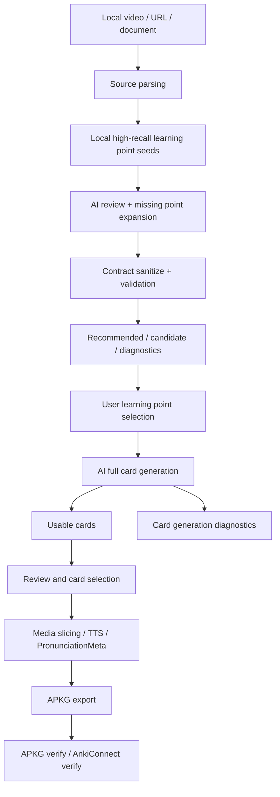

# Architecture

This document describes the current desktop app architecture for maintenance and release checks.

## Product Flow


```mermaid
flowchart TB
  A["Local video / URL / document"] --> B["Source parsing"]
  B --> C["Local high-recall learning point seeds"]
  C --> D["AI review + missing point expansion"]
  D --> E["Contract sanitize + validation"]
  E --> F["Recommended / candidate / diagnostics"]
  F --> G["User learning point selection"]
  G --> H["AI full card generation"]
  H --> I["Usable cards"]
  H --> J["Card generation diagnostics"]
  I --> K["Review and card selection"]
  K --> L["Media slicing / TTS / PronunciationMeta"]
  L --> M["APKG export"]
  M --> N["APKG verify / AnkiConnect verify"]
```

The user-facing workflow is intentionally simple:

```text
素材配置 -> 学习设置 -> 确认抽取 -> 审核导出
```

Internally, the worker still keeps quality status, diagnostics, duplicate folding, hard blockers, and validation issues. The UI no longer asks users to choose between catch_all/curated/exhaustive. Learning point extraction is now AI-reviewed: local rules produce seeds, but formal extraction requires a tested model API.

## Frontend

Main entry points:

- `src/app/useAppController.ts`: application state, settings actions, generation/export actions, worker jobs.
- `src/app/AppShell.tsx`: desktop shell and stage layout.
- `src/features/app/*`: top bar and workflow console.
- `src/features/learning/*`: source and generation settings.
- `src/features/review/*`: usable cards, segment list, card details, learning point diagnostics.
- `src/features/settings/*`: model API, TTS, local environment.
- `src/domain/*`: types, defaults, language profiles, quality selectors, inventory materialization.
- `src/services/*`: Tauri worker calls, native shell, settings profiles, API config, storage, secrets.

The UI uses a staged workspace:

1. `source`: source setup.
2. `generate`: settings/progress.
3. `review`: card review/export.

The left workflow console is informational and operational. The right workspace keeps the dense review surface.

## Learning Point Inventory

The worker returns AI-reviewed learning points before full cards are generated. Recommended learning points are selected by default; candidate learning points remain selectable; reject/duplicate/hard-blocked items stay in diagnostics.

Inventory statuses:

- `card_generated`: full card exists.
- `candidate_only`: legal learning point, not generated into a full card yet.
- `hidden_duplicate`: duplicate training action.
- `hard_blocked`: cannot become a card.

Hard blockers include:

- `exact_span` not found in source sentence.
- `answer_core` contains Chinese, IPA, grammar explanation, or pronunciation notes.
- hallucinated or malformed learning point.
- true duplicate with same learning action.

The review UI defaults all usable cards to selected. Candidate-only learning points are visible in diagnostics/learning-point selection, but are not exported unless the user selects them and generates full cards.

## Card Templates

Current video/subtitle templates:

- `immersive_v11`: default stable template.
- `ciba_tianxia_v1`: experimental language-action mode.

`ciba_tianxia_v1` is intentionally isolated by `template_id`. It changes:

- AI learning point review prompt.
- learning value scoring preference.
- final card-generation prompt.
- Anki model family/tag label.
- exported Anki front/back card face.

It uses independent exported Anki front/back assets for the visible card face. The front prioritizes retrieval prompts, while the back organizes existing note fields as language action, contextual meaning, transfer examples, collocation boundary, listening evidence, and source scene.

It still reuses the same genanki note field schema as the other language templates; `ciba_tianxia_v1` is a template/prompt/export-layout mode, not a separate learning-point data model.

## Language And Pronunciation

Stable language code:

```ts
type LearningLanguageCode = "en" | "fr" | "es" | "ja" | "ru"
```

Pronunciation profile includes:

- `language_code`
- `accent_profile`
- `notation_system`
- `generation_basis`
- `field_confidence`
- `same_as_standard_reason`
- `pitch_confidence`
- `validation_issues`
- `field_changes`

Legacy fields remain:

- `phonetic_ipa`
- `spoken_ipa`
- `source_spoken_ipa`
- `pronunciation_confidence`

UI labels are generic, but hints explain the per-language notation system:

- English: IPA / weak forms.
- French: API/IPA / liaison.
- Spanish: syllable + stress.
- Japanese: kana + pitch when reliable.
- Russian: stressed Cyrillic.

V1 does not perform ASR or forced alignment. Default inferred pronunciation uses:

```text
generation_basis = subtitle_inferred
```

`audio_verified` is reserved for future ASR/forced-alignment work.

## Tauri Boundary

Rust/Tauri is the trusted local boundary.

Responsibilities:

- whitelist worker commands
- start/cancel long-running worker jobs
- emit worker progress events
- store secrets through OS credentials / DPAPI fallback
- reveal only allowed output paths
- open Anki for `.apkg` files
- run native bootstrap environment checks
- repair Python runtime before Python worker exists

Important commands:

- `run_worker`
- `start_worker_job`
- `cancel_worker_job`
- `check_bootstrap_env`
- `repair_bootstrap_env`
- `save_secret`
- `load_secret`
- `delete_secret`
- `open_anki_import`
- `reveal_path`

## Bootstrap Environment Repair

The app has two repair layers.

### Native bootstrap layer

Runs in Tauri and does not require Python.

It can:

- detect Python runtime
- try installing recommended Python 3.12 through winget
- show fallback environment status when Python worker cannot start

### Python worker repair layer

Runs after Python is available.

It can:

- create `.venv`
- install/upgrade worker requirements
- install FFmpeg through winget
- install Deno through winget
- install Anki through winget
- open/provide AnkiConnect plugin steps

AnkiConnect is not silently installed because it requires confirmation inside Anki.

## Worker

`workers/anki_worker.py` is a small command router. The large implementation is still in `workers/acg/legacy_worker.py` while command boundaries are extracted.

Current command modules:

- `workers/acg/commands/check_env.py`
- `workers/acg/commands/repair_env.py`
- `workers/acg/commands/generate.py`
- `workers/acg/commands/export.py`
- `workers/acg/commands/test_api.py`
- `workers/acg/commands/test_tts.py`
- `workers/acg/commands/verify.py`

Worker protocol supports:

- `schema_version`
- `warnings`
- `error_code`
- `stage`
- `retryable`
- `fallbacks`
- progress events through stderr with `__ANKI_CARD_PROGRESS__`

## Export

APKG export writes:

- notes/cards
- media files
- media manifest
- media ledger
- TTS text hash
- pronunciation metadata
- template tags

TTS contract:

- `TtsAudio` reads the full source sentence.
- `PhraseTtsAudio` reads the visible core answer.
- TTS output volume defaults to 0.65.
- Text hash is based on text, not volume.

## Release Gates

Fast local gate:

```powershell
npm run lint
npm run test:unit
npm run build
python -m pytest tests\test_worker_quality.py -q -k "check_env or repair_env"
cargo check --manifest-path src-tauri/Cargo.toml
```

Full release gate:

```powershell
npm run check:full
npm run tauri:build
```

Do not commit generated projects, APKG files, videos, audio, temp JSON, or Playwright snapshots.
