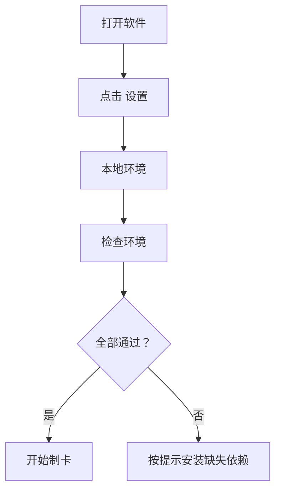

# 用户指南

## 1. 准备运行环境

先打开 PowerShell，运行：

```powershell
powershell -ExecutionPolicy Bypass -File scripts/setup_runtime.ps1
```

这个脚本会检查 Python、FFmpeg、Anki，并安装 worker 需要的 Python 包。

## 2. 打开软件并检查环境

进入软件右上角“设置”：




环境检查至少应该看到：

| 项目 | 状态 |
| --- | --- |
| Python | 显示版本号 |
| ffmpeg | 绿色 |
| genanki | 绿色 |
| yt-dlp | 绿色，URL 导入需要 |

## 3. 配置 MIMO

在“设置 - 文本模型”中选择：

- MIMO Token Plan SGP，或
- MIMO Public V2.5 Pro

填写自己的 API Key。TTS 在“语音模型”中单独配置；如果文本模型已经填了 MIMO Key，TTS 可以复用。

## 4. 从 YouTube 生成卡片

1. 左侧选择“视频链接”。
2. 粘贴 YouTube URL。
3. 学习设置里建议使用“自动片段”。
4. 选择水平，比如 B1。
5. 点击“生成卡片”。


生成完成后先看右侧预览：

- 推荐：默认导出。
- 待审：需要人工确认后再勾选。
- 已拒绝：低价值或重复内容，不建议导出。
- 重复合并：已经被去重处理。

每个片段点开后可以看到视频片段、原句、重点词伙、评分和解释，导出前可以直接改字段：


## 5. 导出到 Anki

1. 点击“只保留推荐”。
2. 点击“导出 .apkg”。
3. 在 Anki 里导入生成的 `.apkg`。
4. 如果已安装 Anki，可以用软件里的打开/导入按钮。

## 6. 常见问题

### 打开后生成不了卡片

先到“设置 - 本地环境”点击“检查环境”。常见原因是 Python、FFmpeg 或 yt-dlp 没装好。

### YouTube 不能下载

先更新 yt-dlp 和它的 EJS / impersonation 依赖：

```powershell
python -m pip install --upgrade -r workers/requirements.txt
```

如果错误里出现 `Remote component challenge solver`、`n challenge solving failed`，请确认本机能运行 Deno 或 Node.js。软件会自动给 yt-dlp 加 `--remote-components ejs:github`，但仍然需要一个 JavaScript runtime。

如果错误是 `HTTP Error 429: Too Many Requests`，通常是 YouTube 当前网络/IP 被限流，字幕接口尤其容易触发。可以稍后重试、换网络/代理，或先自己准备视频和 SRT 字幕，然后走“本地视频 + SRT”。

### 导出没有 TTS

检查“设置 - 语音模型”：

- TTS 是否启用。
- API Key 是否可用。
- MIMO Token Plan Key 是否使用 SGP Base URL。

### 卡片太少

建议使用“自动片段”。软件会先生成更多候选，再由 MIMO 评审过滤，不靠重复内容凑数量。
