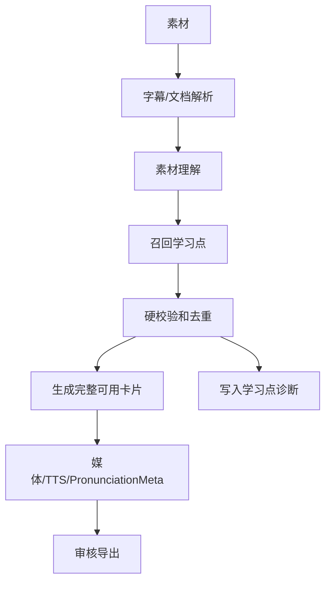

# 用户指南

这份指南按普通用户的实际操作顺序写：先让本地环境跑起来，再配置模型和 TTS，最后生成、审核、导出 Anki 卡包。

## 1. 第一次打开

打开桌面端后，主界面分为三段：

1. `素材配置`：选择本地视频、视频链接或文档资料。
2. `生成设置`：选择学习语言、自动/手动难度、卡片类型、模板和预览偏好。
3. `审核导出`：检查可用卡片、学习点诊断，选择要导出的卡。


顶部右侧有常用操作：

- `设置`：模型 API、语音 TTS、本地环境。
- `生成卡片`：开始生成。
- `导出`：生成完成后导出已选卡片。
- `收起面板`：收起左侧流程台，留出更多审核空间。

## 2. 检查和修复本地环境

进入 `设置 -> 本地环境`。


点击 `检查环境`，应用会检测：

| 项目 | 用途 |
| --- | --- |
| Python 运行环境 | 启动制卡 worker |
| 项目 `.venv` | 隔离 Python 依赖 |
| genanki | 生成 `.apkg` |
| yt-dlp | 下载 YouTube 视频/字幕 |
| FFmpeg | 视频切片、转音频、生成封面 |
| Deno / Node | 解决 YouTube n challenge |
| Anki 桌面端 | 打开或导入 APKG |
| AnkiConnect | 导入后核验卡片和媒体 |

如果缺少依赖，点击 `一键修复全部可修复项`。

当前自动修复能力：

- 缺少 Python 时，原生层会尝试通过 `winget` 安装推荐 Python 3.12。
- Python 可用后，会创建 `.venv` 并安装/更新 `genanki`、`yt-dlp`、`pypdf`。
- 缺少 FFmpeg 时，会尝试通过 `winget` 安装 `Gyan.FFmpeg`。
- 缺少 Deno/Node 时，会尝试通过 `winget` 安装 Deno。
- 缺少 Anki 时，会尝试通过 `winget` 安装 Anki。
- AnkiConnect 需要在 Anki 内确认安装，应用会提示插件代码 `2055492159`。

如果电脑没有 `winget`，对应项目会显示手动安装步骤。

## 3. 配置模型 API

进入 `设置 -> 模型 API`。


推荐流程：

1. 在快速切换区选择模型方案。
2. 如果该方案需要 API Key，填写 Key。
3. 点击 `保存模型方案`，保存到“我的模型”。
4. 点击 `测试连接`。

注意：

- Gemini Vertex 使用本机 `gcloud` OAuth，不需要在应用里填 API Key。
- Vertex 文本模型默认使用 `gemini-3.1-pro-preview`。
- 每个模型方案的 Key 单独保存，不再所有服务商共用同一个 Key。
- Key 不会写入仓库；用户选择保存时，优先写入 Windows Credential Manager。

常见模型选择：

| 场景 | 建议 |
| --- | --- |
| 高质量英语/多语言卡 | Gemini Vertex / Qwen / DeepSeek / MIMO 中选择稳定方案 |
| 快速试流程 | 选择响应更快、成本更低的模型 |
| 长视频深度理解 | 使用支持 reasoning/thinking 且 JSON 稳定的模型 |
| Vertex | 先确认 `gcloud auth login` 和 `gcloud config set project <project-id>` |

## 4. 配置语音 TTS

进入 `设置 -> 语音 TTS`。


TTS 和文本模型分开配置：

- `TtsAudio`：整句 AI 朗读。
- `PhraseTtsAudio`：核心表达/答案朗读。
- 原视频音频不会被 TTS 替代。

当前设计：

- TTS 服务商、模型、音色、Key 可以单独保存。
- Gemini Vertex TTS 使用本机 `gcloud` OAuth，不需要填写 TTS API Key。
- 导出时默认把 AI TTS 音量降到 65%，避免比原视频声音刺耳。
- 预览播放速度只影响应用内试听，不改变导出的 Anki 音频。

英语 TTS 建议：

- 能听清原视频时，优先用原声。
- 额外整句朗读和表达朗读再用 AI TTS。
- Vertex TTS 可从 `Kore / Aoede / Puck / Charon` 等 voice 里试。
- Qwen 英语可优先试 `Jennifer` 或 `Aiden`。

## 5. 选择素材

### 本地视频 + SRT

适合自己已有视频和字幕。

1. 选择 `本地视频`。
2. 选择视频文件。
3. 选择 SRT 字幕；如果留空，应用会尝试同目录自动匹配 SRT/VTT，也会尝试读取 MKV/MP4 内嵌字幕。
4. 根据需要选择是否跳过视频切片。

如果没有 SRT：

- 有内嵌字幕时，应用会尝试提取。
- 没有字幕时，当前版本不会自动 ASR；建议先用 Whisper、本地 ASR 或线上 ASR 转成 SRT，再导入。

### 视频链接 / YouTube

1. 选择 `视频链接`。
2. 粘贴 URL。
3. 默认尝试下载视频 + 字幕。
4. 如果视频下载失败但字幕可用，可以切到字幕-only。

URL 失败常见原因是 YouTube 429、区域限制、字幕不可用或 n challenge。先看 [故障排查](TROUBLESHOOTING.md)。

### 文档资料

支持 TXT、Markdown、DOCX、EPUB、PDF。

文档有两种目标：

- `知识吸收`：概念、观点、术语、例子，适合课程、论文、技术文档。
- `语言精读`：表达、词汇、语法，适合英文文章或书籍。

文档模式不会生成听力卡，因为没有原声。

## 6. 生成设置

### 学习语言

支持：

- English
- Francais
- Espanol
- 日本語
- Русский

内部使用稳定 code：`en / fr / es / ja / ru`。

不同语言使用不同读法体系：

| 语言 | 读法体系 |
| --- | --- |
| English | IPA + weak forms/linking/stress |
| French | API/IPA + liaison/e caduc |
| Spanish | 拉美通用读法，音节 + 重音，可选 IPA |
| Japanese | 假名 + 可靠时才标音高 |
| Russian | 带重音西里尔，可选 IPA |

### 学习水平

默认是 `自动判断`。

推荐保持自动。生成后每张卡会带：

- estimated level
- difficulty
- difficulty reason

如果手动选择 A1-C2，它只作为软偏好，影响解释深度和筛选倾向，不作为硬门槛。

### 预览播放速度

左侧统一设置预览播放速度：

- 0.75x
- 1x
- 1.25x

它只影响应用内预览，不影响导出的 Anki 音频。

## 7. 生成卡片

点击顶部 `生成卡片`。

浏览器预览会生成 demo 卡；桌面端会真实调用 worker、模型、FFmpeg 和 TTS。

生成流程大致是：


```mermaid
flowchart TB
  A["素材"] --> B["字幕/文档解析"]
  B --> C["素材理解"]
  C --> D["召回学习点"]
  D --> E["硬校验和去重"]
  E --> F["生成完整可用卡片"]
  E --> G["写入学习点诊断"]
  F --> H["媒体/TTS/PronunciationMeta"]
  H --> I["审核导出"]
```

统一智能筛选会尽量召回合法学习点，但不会把所有候选都直接制成完整卡。这样能兼顾质量、速度和成本。

## 8. 审核导出

生成完成后进入 `审核导出`。


顶部统计含义：

| 指标 | 含义 |
| --- | --- |
| 生成卡片数 | 已经生成完整内容的可用卡片 |
| 已选卡片数 | 当前会导出的卡片 |
| 发现学习点 | 系统从素材中找到的学习点总数 |
| 更多学习点 | 合法但未制成完整卡的候选 |
| 重复 / 硬阻断 | 被折叠或不能制卡的学习点 |

可用卡片默认全部选中。你可以：

- 全选
- 全不选
- 反选
- 只看已选
- 只看未选
- 按片段启用/停用
- 单卡勾选/取消

导出只导出当前选中的完整卡片。

## 9. 学习点诊断

`学习点诊断` 用来解释“为什么某些学习点没有变成卡”。

常见状态：

| 状态 | 含义 |
| --- | --- |
| card_generated | 已生成完整卡 |
| candidate_only | 合法、有价值，但暂未生成完整卡 |
| hidden_duplicate | 训练动作重复，被折叠 |
| hard_blocked | 不能制卡，例如跨度不存在、答案混入中文/IPA/解释 |

候选库 V1 先保证可见、可筛选、可解释。后续可以继续加“一键把候选生成完整卡”。

## 10. 发音字段

视频语言卡会包含：

- 标准读法
- 推测口语读法 / 剧中读法
- 原句听感
- 发音说明
- PronunciationMeta 隐藏 JSON

当前 V1 不做真实 ASR 或 forced alignment，所以默认：

```text
generation_basis = subtitle_inferred
```

也就是说，没有音频实听时，应用不会把字幕推测包装成“剧中实际读法”。如果某个发音字段被隐藏、清空或降级，`PronunciationMeta.field_changes` 会记录原因。

## 11. 导出 APKG

确认卡片后点击 `导出已选`。

导出内容包括：

- Anki notes/cards
- 视频切片
- 原声片段
- 整句 TTS
- 表达 TTS
- PronunciationMeta
- media manifest
- TTS ledger

导出后可以：

- 手动在 Anki 导入 `.apkg`。
- 让应用打开 Anki 导入。
- 使用 AnkiConnect 做导入核验。

## 12. AnkiConnect

AnkiConnect 插件用于导入后自动核验。

安装步骤：

1. 打开 Anki。
2. 工具 -> 插件 -> 获取插件。
3. 输入插件代码：`2055492159`。
4. 重启 Anki。
5. 回到应用设置页，点击 `检查环境`。

环境页会区分：

- Anki 没安装。
- Anki 已安装但没打开。
- Anki 已打开但 AnkiConnect 未连接。
- AnkiConnect 正常。

## 13. 推荐的端到端测试

每次发布前建议跑：

```powershell
npm run lint
npm run test:unit
npm run build
python -m pytest tests\test_worker_quality.py -q -k "check_env or repair_env"
cargo check --manifest-path src-tauri/Cargo.toml
```

完整桌面端回归：

1. 打开桌面端。
2. 检查本地环境。
3. 测试模型 API。
4. 测试 TTS。
5. 用本地视频 + SRT 生成。
6. 检查可用卡片和学习点诊断。
7. 导出 APKG。
8. 运行 APKG verify。
9. 导入 Anki，抽查音频、视频、发音字段和隐藏 JSON。

## 14. 常见理解误区

### 一键修复是不是完全无人值守？

不是。能自动安装的会自动安装，但 AnkiConnect 必须在 Anki 内确认安装。没有 winget 时，系统级依赖也需要手动安装。

### 能不能把所有学习点都导出？

当前能导出的是“已经生成完整卡片”的可用卡。学习点诊断里能看到更多候选，但 V1 不默认为所有候选生成 TTS、媒体和完整 Anki 字段。

### 为什么不用最新版 Python？

应用推荐 Python 3.12，因为它比“最新版”更稳定。最新版可能带来依赖兼容波动。

### 为什么没有 SRT 不能直接听懂视频？

当前 V1 不内置 ASR。没有字幕时，建议先用本地 Whisper 或线上 ASR 转 SRT，再导入。

### 为什么发音字段会显示“推测”？

因为没有真实音频对齐时，读法来自字幕和常见口语规律推断。应用宁愿标低置信度，也不误导学习者。
