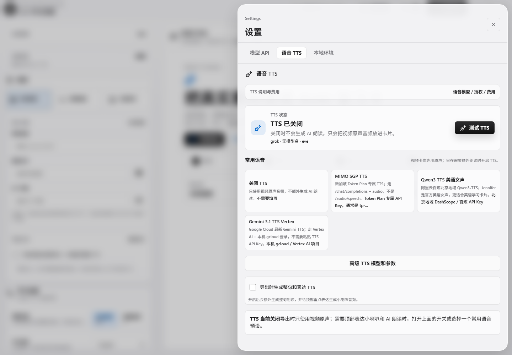
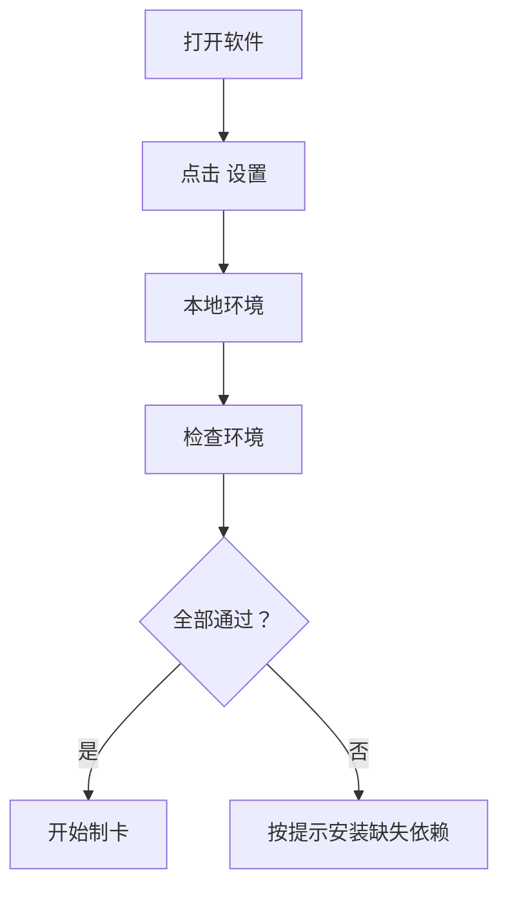
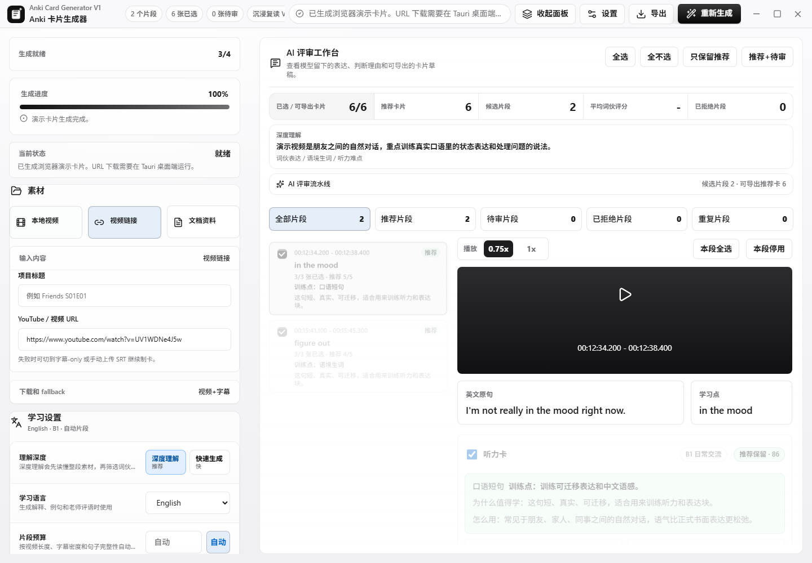
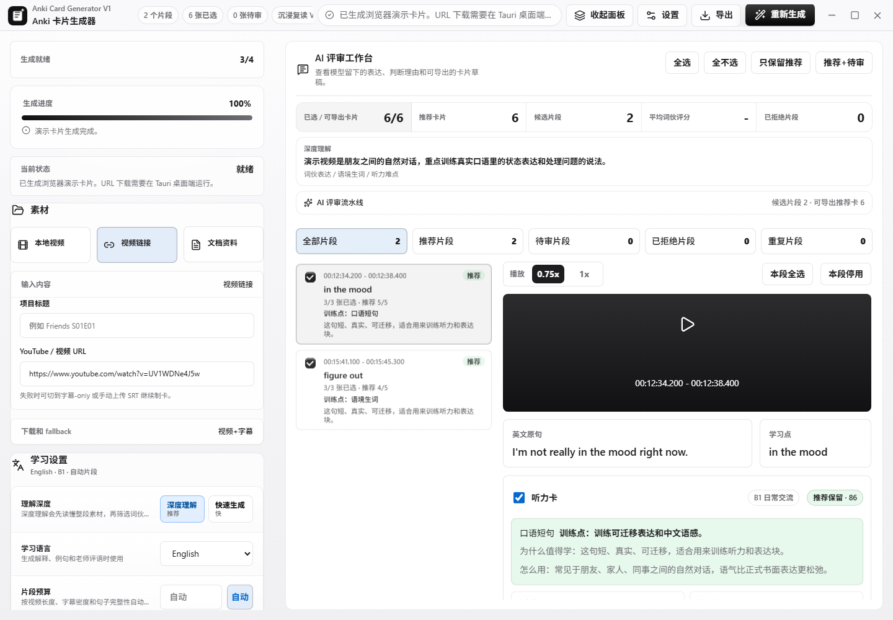
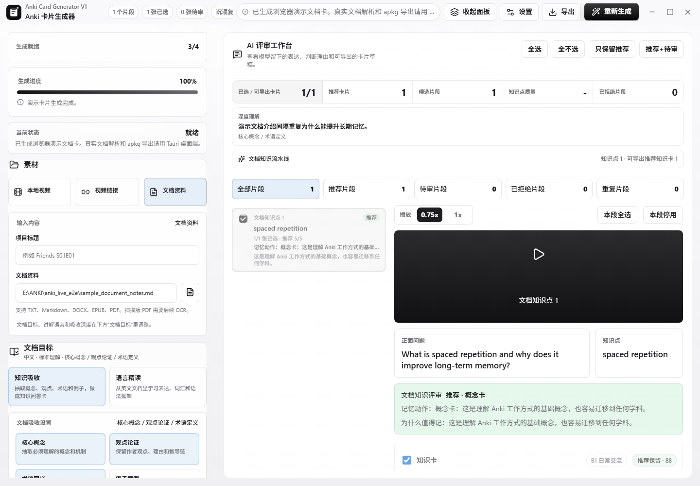

# 用户指南

## 1. 准备运行环境

先打开 PowerShell，运行：

```powershell
powershell -ExecutionPolicy Bypass -File scripts/setup_runtime.ps1
```

这个脚本会检查 Python、FFmpeg、Anki，并安装 worker 需要的 Python 包。

## 2. 打开软件并检查环境

进入软件右上角“设置”。桌面端会保护最小窗口尺寸，窗口缩到一定大小后不会继续变窄，这样可以避免左侧设置和右侧预览被压坏：




```mermaid
flowchart TB
  A["打开软件"] --> B["点击 设置"]
  B --> C["本地环境"]
  C --> D["检查环境"]
  D --> E{"全部通过？"}
  E -->|是| F["开始制卡"]
  E -->|否| G["按提示安装缺失依赖"]
```

环境检查至少应该看到：

| 项目 | 状态 |
| --- | --- |
| Python | 显示版本号 |
| ffmpeg | 绿色 |
| genanki | 绿色 |
| yt-dlp | 绿色，URL 导入需要 |

## 3. 配置模型和 TTS

在“设置 - 文本模型”中选择：

- MIMO Token Plan SGP，或
- MIMO Public V2.5 Pro
- DeepSeek V4 Pro / DeepSeek V4 Flash，或
- Qwen / DashScope 兼容接口，或
- 其他 OpenAI-compatible 服务商

填写自己的 API Key。DeepSeek V4 的 Base URL 使用 `https://api.deepseek.com`，模型名填真实 ID：`deepseek-v4-pro` 或 `deepseek-v4-flash`。TTS 在“语音模型”中单独配置；如果文本模型已经填了 MIMO 或 Qwen / DashScope Key，TTS 可以复用。

DeepSeek V4 / Qwen / MIMO 这类模型会先 thinking 再输出最终 JSON。应用会流式接收 thinking 进度，保留模型思考能力，但只把最终 JSON 用于制卡，避免进度长时间停住或把 thinking 文本混进卡片字段。

英语卡片的 TTS 建议：

- 优先用视频原声；AI TTS 主要用于额外整句朗读和表达小喇叭。
- MiMo V2.5 TTS 当前更适合自然英语学习卡。
- Qwen3 TTS 推荐先试 `Jennifer` 美语女声或 `Aiden` 美语男声；`Cherry` 支持英语，但不是最推荐的英语学习默认音色。
- 需要控制语速、情绪或朗读风格时，用 `qwen3-tts-instruct-flash`；需要自定义角色音色时，先用 Qwen3 声音设计创建 voice id，再填入“声音 / voice_id”。

## 4. 从 YouTube 生成卡片

1. 左侧选择“视频链接”。
2. 粘贴 YouTube URL。
3. 默认使用“下载视频+字幕”。如果网络经常失败，展开“下载和 fallback”，可以切到“只用字幕生成”或打开“视频下载失败时自动 fallback 到字幕-only”。
4. 学习设置里建议使用“自动片段”。
5. “理解深度”默认是“深度理解”。它会先读懂整段素材，再筛选候选和写卡；如果只想快速试流程，可以切到“快速生成”。
6. 选择水平，比如 B1。
7. 点击“生成卡片”。



生成完成后先看右侧预览：

- 推荐：默认导出。
- 待审：需要人工确认后再勾选。
- 已拒绝：低价值或重复内容，不建议导出。
- 重复合并：已经被去重处理。
- 素材理解：显示模型对这段视频/文档的全局理解，用来判断卡片是否真的来自当前素材。

每个片段点开后可以看到视频片段、原句、学习点、评分和解释。学习点可能是词伙表达、语境生词、语法框架或听力难点，导出前可以直接改字段：



## 5. 导出到 Anki

1. 点击“只保留推荐”。
2. 点击“导出 .apkg”。
3. 在 Anki 里导入生成的 `.apkg`。
4. 如果已安装 Anki，可以用软件里的打开/导入按钮。

导出的卡片会按素材类型自动选择模板：视频 / 字幕语言卡默认使用“沉浸复读 V11”，正面只显示复读任务、大视频、`原声` 和 `慢读` 按钮，背面再显示核心表达、中文直觉、原句、小视频回放、表达小喇叭和解释块；文档知识卡使用“核心答案 / 关键机制 / 例子 / 边界”结构；文档精读卡使用“核心答案 / 原文线索 / 怎么理解 / 怎么用 / 边界”结构。模板继续保留兼容字段名，方便旧字段和后续校验继续复用。

## 6. 从文档资料生成知识卡

文档资料默认不是视频语言学习路径。切到“文档资料”后，左侧会显示“文档目标”，默认是“知识吸收”：

- 讲解语言：中文 / 英文 / 双语，默认中文。
- 吸收重点：核心概念、观点论证、术语定义、例子案例，默认前三项。
- 卡片深度：快速记忆 / 标准理解 / 深入掌握。
- 答案长度：短答案 / 中等答案 / 详细答案。

知识吸收模式会隐藏 A1-C2、听力卡、表达卡、俚语/脏话等视频语言学习设置。它适合书籍、论文、课程资料、技术文档和长文章。

如果你上传的是英文文章，并且想专门学习里面的表达、词汇和语法，可以把文档目标切到“语言精读”。语言精读不会生成听力卡，生成结果默认更适合先人工待审。



## 7. 常见问题

### 打开后生成不了卡片

先到“设置 - 本地环境”点击“检查环境”。常见原因是 Python、FFmpeg 或 yt-dlp 没装好。

### YouTube 不能下载

先更新 yt-dlp 和它的 EJS / impersonation 依赖：

```powershell
python -m pip install --upgrade -r workers/requirements.txt
```

如果错误里出现 `Remote component challenge solver`、`n challenge solving failed`，请确认本机能运行 Deno 或 Node.js。软件会自动给 yt-dlp 加 `--remote-components ejs:github`，但仍然需要一个 JavaScript runtime。

如果错误是 `HTTP Error 429: Too Many Requests`，通常是 YouTube 当前网络/IP 被限流，字幕接口尤其容易触发。可以稍后重试、换网络/代理，或先自己准备视频和 SRT 字幕，然后走“本地视频 + SRT”。

如果只是视频下载失败，但字幕能下载，改用“只用字幕生成”。这种导出的卡包不包含视频片段和原声音频，但可以继续保留英文原句、表达解释和 TTS。

### 导出没有 TTS

检查“设置 - 语音模型”：

- TTS 是否启用。
- API Key 是否可用。
- MIMO Token Plan Key 是否使用 SGP Base URL。
- Qwen / DashScope TTS 是否使用对应地域的 Base URL。

如果只是听感不自然，先把审核页试听速度切到 `1x` 再判断；`0.75x` 只影响软件内试听，不会写入导出的 Anki MP3。Qwen3 英语音色建议优先试 `Jennifer` 或 `Aiden`。

### 卡片太少

建议使用“自动片段”。软件会先生成更多候选，再由模型或本地规则过滤，不靠重复内容凑数量。生成后看右侧质量仪表盘：视频 / URL 会显示候选数、推荐数、待审数、拒绝数、重复合并数和平均词伙评分；文档会显示知识点或精读点质量。

### 语境生词卡是什么

语境生词卡不是普通词典卡。它只选择原句里真正值得学的词，要求能说明这个词在当前场景里的意思、搭配、中文容易误解的地方，以及下次怎么复用。比如 `awkward` 不会只写“尴尬的”，而会解释 `This is getting awkward.` 里气氛正在变得不自在，常见搭配是 `get awkward / feel awkward`。

如果你只想做传统表达卡，可以在“学习重点”里关闭“单词用法”；默认建议保留它，因为很多视频里最值得学的点不是长表达，而是一个词在真实语境里的用法。

### 左侧设置太多

v0.9.2-beta 起，左侧 Inspector 会把不常用的选项收进展开项。视频 / URL 常用流程只需要关注“素材”“学习设置”和右上角“生成卡片”；文档流程只需要关注“素材”“文档目标”和“生成卡片”。需要调下载策略、难度范围、文档深度或模板时再展开对应条目。
