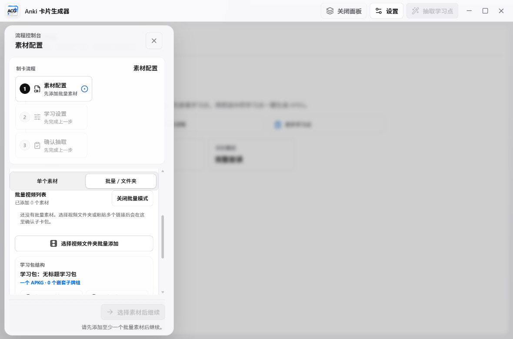

# Anki Card Generator Windows Desktop E2E Test Protocol

Date: 2026-06-26

Scope: Windows desktop app only. Browser / Local Helper work remains paused and is not included in this validation.

## Executive Result

Latest candidate Windows desktop build from branch `codex/v0.9.4-beta-sidebar-main` passed installation, startup, compact UI, local permission, APKG export, APKG verification, unit, UI, worker, production build, and Rust/Tauri checks.

No product code changes were required during this validation. The only issues encountered were QA harness issues: Playwright module resolution from `C:\tmp`, sandbox write permission for evidence files, a brittle button locator, and a credential probe key that correctly failed the app's secret-key whitelist. The harness was corrected without changing product code.

Live Anki import was not executed because AnkiConnect was not available on `127.0.0.1:8765` at test time. The app correctly reported Anki as installed but not running and AnkiConnect as requiring user setup.

## Candidate Package

Candidate artifacts were rebuilt locally from the current branch and copied outside the repository:

```text
C:\tmp\anki-card-generator-windows-e2e-20260626-212742\candidate\
```

SHA256:

```text
3a28606886507a1b59aa64f9acd0cbf3fad5980df6b9d2f8b7aea788d38b4340  Anki Card Generator_0.9.4_x64-setup.exe
6a37199f397d371f4d2517601d3b2ed8da7ccbfca23044782b01ef04dd706430  Anki Card Generator_0.9.4_x64_en-US.msi
```

The installer, MSI, APKG, media files, logs, and raw smoke output are not committed to Git.

## Install And Startup

1. Existing installed app was detected as `Anki Card Generator 0.9.4`.
2. Running app processes were closed.
3. Old program files were uninstalled through the existing user-level uninstaller.
4. User config and credentials were preserved; the app data directory remained present after uninstall.
5. Candidate NSIS installer was installed silently.
6. Windows app registration showed `Anki Card Generator 0.9.4`.
7. Installed executable version info showed `0.9.4`.
8. Installed app was launched from `%LOCALAPPDATA%\Anki Card Generator\anki-card-generator.exe`.
9. Startup produced the desktop UI title `Anki 卡片生成器`.
10. Normal startup leaves only the app process and WebView2 child process. No extra terminal window was detected.
11. After QA, the app was relaunched normally and WebView2 debug port `9333` was confirmed closed.

## Installed UI And Permission Probe

Installed app was temporarily started with WebView2 CDP enabled only for automation. The probe did not clear localStorage and did not read or print real API keys.

Evidence screenshot:



Validated at `1180x780`:

- Connected to the installed WebView.
- `Anki 卡片生成器` title visible.
- Compact responsive mode active.
- Material panel opened.
- `批量 / 文件夹` reachable and actionability-checked.
- `选择视频文件夹批量添加` visible, reachable, and actionability-checked with a trial click so the native folder picker was not opened.
- Bottom `选择素材后继续` CTA visible and reachable.
- No horizontal overflow.

Permission checks through the installed Tauri bridge:

- Local video subtitle suggestion: passed.
- Batch folder enumeration: passed.
- Temporary profile credential save/load/delete: passed.
- Arbitrary credential keys are rejected by whitelist as expected.
- Environment check command callable: passed.

Environment status observed:

- Python runtime available from the installed app bundle.
- FFmpeg available.
- Anki installed.
- Anki was not running.
- AnkiConnect was not available on `127.0.0.1:8765`.
- genanki / yt-dlp status showed action-required in environment UI until worker-side dependency check or repair is run.

## End-To-End Generation

`npm.cmd run smoke:release` passed.

Smoke result:

- Segments generated: 1.
- APKG exported: yes.
- APKG verify mode: `sqlite_fallback`.
- Note count: 1.
- Card count: 1.
- Required model/template present.
- MP4 video source present.
- WebM video source present.
- Poster field present.
- Audio field present.
- TTS media present.
- Missing archive media: none.
- Missing referenced media: none.
- Missing required fields: none.
- TTS text hash mismatches: none.
- Phrase TTS text hash mismatches: none.

Live Anki import / AnkiConnect verify was not run because AnkiConnect was not reachable. This is recorded as an environment limitation, not a product failure.

## Automated Regression

Passed:

```text
npm.cmd run check:versions
npm.cmd run test:ui
npm.cmd run build
cargo check --manifest-path src-tauri/Cargo.toml
npm.cmd run smoke:release
npm.cmd run test:unit
npm.cmd run test:worker
```

Results:

- Version check: passed, `v0.9.4-beta`.
- UI smoke: 3 passed.
- Production build: passed; Vite chunk-size warning only.
- Cargo check: passed.
- Release smoke: passed.
- Unit tests: 62 files / 462 tests passed.
- Worker tests: 436 tests passed.

## Security Boundary

Preserved:

- AppData.
- User configuration.
- Real API keys.
- Credential Manager entries.
- Anki data.
- Historical projects and cache.

Not committed:

- Candidate installers.
- MSI.
- APKG.
- Video/audio media.
- Raw smoke output.
- `release/smoke/`.
- `src-tauri/target/`.
- Local logs and caches.
- `docs/web-helper/`.

Final checks still required before any future PR or Release:

- Run secret scan on report files and git diff.
- Confirm staged diff excludes `src-tauri/Cargo.toml` line-ending-only state.
- Confirm staged diff excludes browser/helper docs unless explicitly requested.

## Conclusion

The Windows desktop candidate is installable and usable on this machine. The full app path from installer to startup, compact UI access, local file/folder permission bridge, credential bridge, generation, APKG export, and APKG integrity verification passed.

The only uncovered live item is AnkiConnect import verification because AnkiConnect was not running or reachable. To cover that last item, open Anki, enable/install AnkiConnect, then rerun a live import verification with a disposable test deck.
